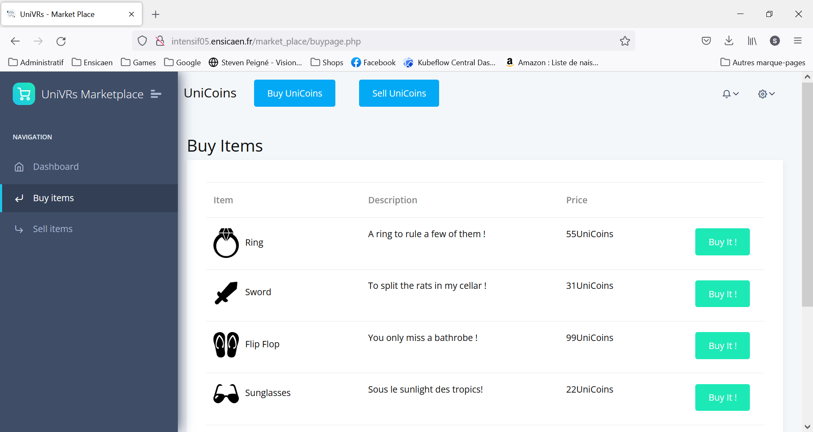

# UNIVRSs WEBSITE  
Projet intensif 3A Site web

# Gestion du serveur
L'école nous fournit une machine virtuelle qui nous sert de serveur. Celle-ci nous permet d'héberger les différents services que l'on a besoin avec notre projet. 

## Serveur WEB 
Notre projet nous demande d'héberger des pages webs pour décrire notre pensée, s'essayer à un exercice de marketing du produit que l'on développe et le projet e lui-même à besoin d'un serveur web.
Pour ce faire, nous avons mis en place un serveur Nginx. Nginx est simple à configurer et à installer, il s'agit donc d'un choix de prédilection pour notre projet d'une semaine.

## Base de Données
Notre projet nécessite une base de donnée pour organiser et stocker les données générées. C'est ainsi que nous sommes parvenus à installer une base de données MySQL. 

La BDD est composé de 2 tables et d'un lien:

## Technologies
HTML, CSS, JavaScript, PHP.
PHP et JavaScript ont été utilisées car ce sont des technologies abordées en cours et facile à mettre en place.
Le langage PHP permet aussi de ne pas utiliser d'API et de communiquer directement avec le serveur.

## Pages du site
Marketdashboard est la page d'accueil une fois connecté.
On peut y voir notre temps d'heures jouées.

"Buy items" est la page où nous accèdons au market pour pouvoir y faire ses emplettes.
Il est renseigné l'image, le nom, la description et le prix de l'item.

"Sell items" nous permet de voir les items que nous avons mis en vente dans un onglet "Sale items".
Il y a la possibilité de retirer un item de la vente.
Enfin, notre inventaire se consulte dans l'onglet "Inventory" pour que nous puissions mettre de nouveaux items en ventes.

Enfin, buyunicoins et sellunicoins permettent d'acheter des UniCoins ou de les échanger contre une devises de notre choix.

